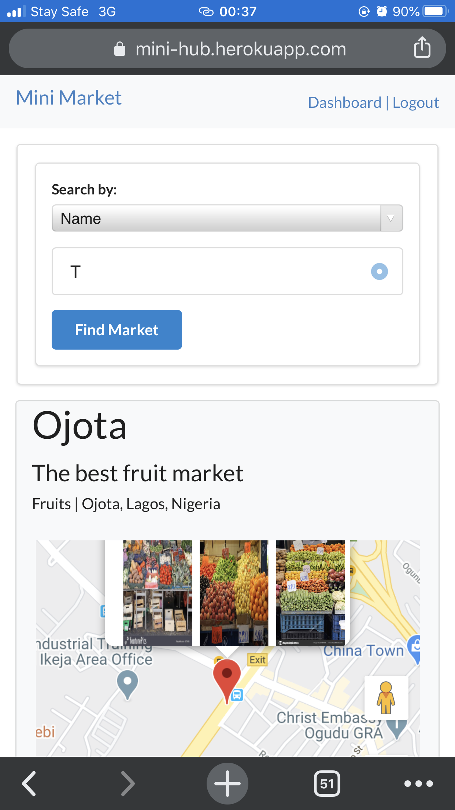

# Mini Market
> https://mini-hub.herokuapp.com



## Installation

Follow this steps to build locally:

```sh
Clone project
composer install
npm install
php artisan migrate:fresh --seed
php artisan serve
```


